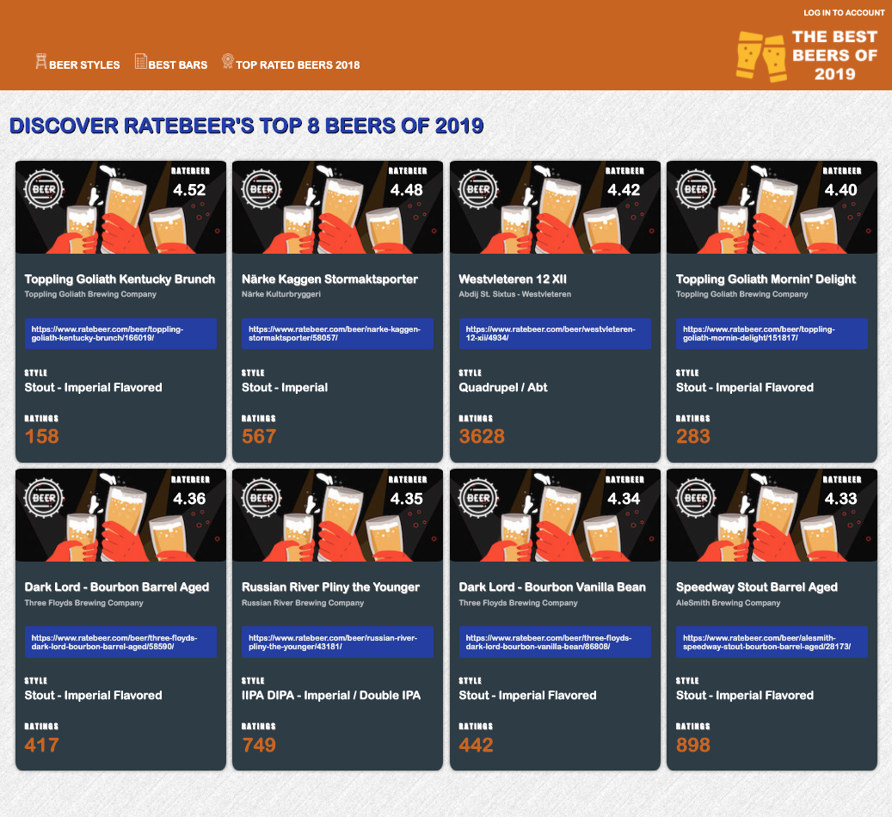

# Comp Challenge 1 #

## About The Project ##

This static comp challenge is the first Turing HTML/CSS challenge, created to help us develop skills in wireframing, building responsive sites, and recreating a layout from a given design. We were given creative license to change copy, images, icons, and color palette, but were required to stay true to the layout of the given design. Additionally, our site was required to work across Firefox, Safari, and Chrome, and we were required to use a normalize or reset file in CSS. Lastly, we were allowed to use flex-box and grid, which I took advantage of throughout this project.

## Project Website Reference ##

## My Approach to The Project ##

I am a big craft beer fan, so for this static comp challenge, I chose to create a website for the top beers on RateBeer, a prestigious beer-rating site, for 2019.

For the header and navigation of the site, I made use of flex-box to correctly align all items. I also added a media query for screen sizes under 800px to realign all elements to the left in a column and hide the logo to make it more user-friendly.

For the main card grid section, I used CSS grid to lay out the cards and achieve even sizing for each. I then added 4 media queries to change the arrangement of cards for four different sets of screen sizes. For the largest screens, cards appear four to a row, and as the screen width decreases, the card layout changes to three cards per row, then two per row, and finally one per row for mobile.

Additionally, within each card, I also used CSS grid for the top third of the card with the background image, in order to achieve proper spacing for the icon and score. Within the body of each card with the text, I accomplished appropriate spacing with margin and padding adjustments for each element.

## My Project ##

### Static Screenshot of Site ###

### Responsiveness in Action ###

